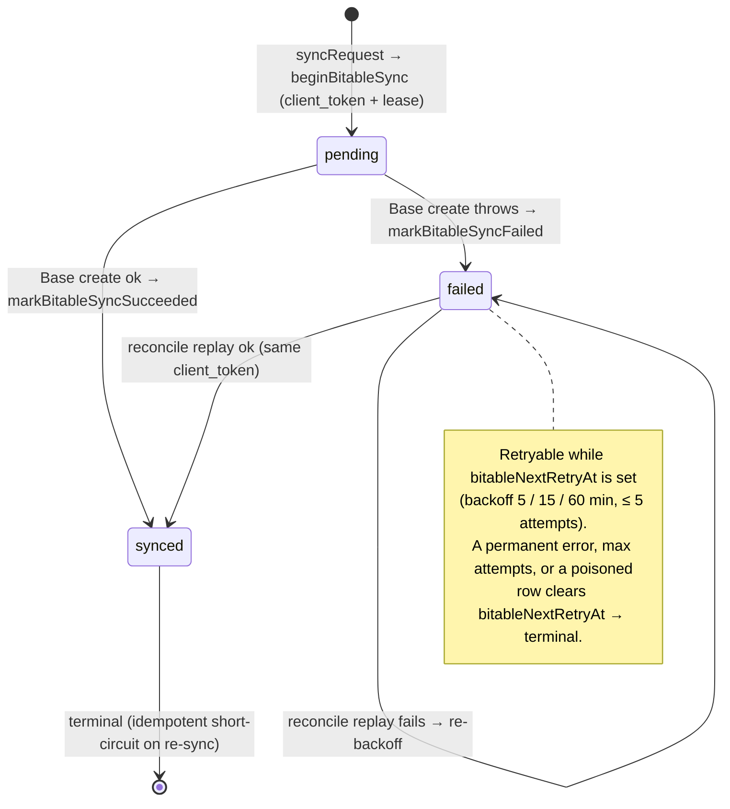

# feishu-sync

An Outlook add-in for **sales-request intake**: it turns a client's inbound email into one structured row in a **Feishu Base** — categorized as **Requests** (Quotation / Sample / R&D Support) with notes and assigned to a Feishu **Coworker** — and keeps a recoverable **Email Record** in Convex. The Vite **SPA** runs in the Outlook taskpane; backend logic and data live in Convex. Forwarding an email *copy* into Feishu chat or via bot webhook — and the email-PDF / attachment / Feishu-Doc machinery — is **retired** ([ADR-0010](docs/adr/0010-pivot-to-bitable-intake.md)).

## Language

**SPA**:
The React + Vite static bundle loaded inside the Outlook taskpane iframe. The same source ships to two hosts: the **ECS Host** (built with base path `/addin/`, served at `https://<host>/addin/`) for the CN audience, and the **Global Host** (built with base `/`, served at `https://outlook-feishu-bridge.pages.dev/`) for everyone else ([ADR-0009](docs/adr/0009-cloudflare-global-host-dual-deploy.md)).
_Avoid_: "frontend" (overloaded), "client", "the addin" (manifest + SPA are different things).

**Outlook Manifest**:
The `OfficeApp` XML at [public/manifest.xml](public/manifest.xml) that Outlook reads to discover the add-in's display name, icons, command surfaces, and taskpane URL. Its `SourceLocation` / `Taskpane.Url` point at the host that serves the **SPA**. It ships with two placeholders — `__ADDIN_DOMAIN__` (the host) and `__ADDIN_BASE__` (the path prefix) — which **must be substituted before sideloading** via `scripts/manifest.sh <domain> [base]`; the raw token makes Outlook fail with "server IP address could not be found". There are two generated manifests, one per host: the **ECS Host** (`<host>` + `addin/`) for CN users, the **Global Host** (`outlook-feishu-bridge.pages.dev` + empty base) for everyone else. Changing a URL forces a manifest regen and re-sideload.
_Avoid_: "the addin config", "the XML".

**ECS Host**:
A single Aliyun ECS Ubuntu 24 instance (`__ADDIN_DOMAIN__`) running nginx. Its primary, steady-state job is serving the **SPA** as static files from `/var/www/addin` under location `/addin/`. It serves the **Mainland-China audience**; the **Global Host** (Cloudflare Pages) serves everyone else from the same codebase ([ADR-0009](docs/adr/0009-cloudflare-global-host-dual-deploy.md)) — so it no longer *replaces* Cloudflare (as ADR-0002 framed it), it runs alongside it. It also runs the **Fallback OAuth Callback** — a small Bun auth server behind nginx ([ADR-0008](docs/adr/0008-fallback-login-via-box.md)). It may *also* be used later as a reverse-proxy fallback to the **Convex Backend** if Mainland-China ↔ US connectivity degrades — that proxy is not built yet.
_Avoid_: "CDN" (there is no CDN in front of it today), "gateway" (it's a web server, not just a proxy), "the backend" (the backend is Convex).

**Global Host**:
The Cloudflare Pages deployment (`outlook-feishu-bridge.pages.dev`, base `/`) that serves the **SPA** to the **non-Mainland-China audience**, complementing the **ECS Host** from one codebase ([ADR-0009](docs/adr/0009-cloudflare-global-host-dual-deploy.md)). Static-only: it uses the primary **OAuth Callback** (host-independent, on `*.convex.site`) but has **no Fallback OAuth Callback** (no Bun server runs on Pages), and its Sentry ingest is direct (no `/_sentry/` tunnel). CSP + SPA fallback come from `public/_headers` + `public/_redirects`, the Cloudflare equivalents of the ECS nginx config.
_Avoid_: "Edge Host" (ADR-0001's superseded "CN Edge Gateway" already attached "edge" to the **ECS Host**), "the CDN", "the pages.dev".

**Atomic Release**:
The deploy mechanism on the **ECS Host**. `scripts/deploy.sh` unpacks each build into `/var/www/releases/<timestamp>/`, flips the `/var/www/addin` symlink to it, and prunes all but the newest 3 releases. Rollback = repoint the symlink at an older release dir.
_Avoid_: "the deploy folder".

**Convex Backend**:
The hosted Convex deployment (`steady-setter-706.convex.{cloud,site}`, project `feishu-route`). Performs the **Base Sync** write — a **tenant-identity call** to the Feishu Base API — and persists the **Email Record** (a recoverable backup / workflow history of each sync). Owns the schema, mutations, queries, and the primary **OAuth Callback** HTTP route. US-hosted; not migrating to Aliyun in this iteration.
_Avoid_: "the server" (it's a hosted backend, not the ECS box).

**OAuth Callback**:
The **primary** path that exchanges a Feishu authorization code for a user token: the HTTP route `GET /feishu/oauth/callback` on `*.convex.site` ([convex/http.ts:7](convex/http.ts:7)). Its URI is registered in the Feishu open-platform console and points directly at Convex. Because it is a Convex **HTTP action**, it shares fate with the Convex action runtime — when that is unavailable, login falls back to the **Fallback OAuth Callback** on the **ECS Host** ([ADR-0008](docs/adr/0008-fallback-login-via-box.md)).
_Avoid_: "the Feishu redirect".

**Fallback OAuth Callback**:
A second, separately-registered redirect URI `GET /feishu/oauth/callback` on the **ECS Host** (`https://<host>/…`), served by a zero-dependency **Bun** server ([server/feishu-auth/](server/feishu-auth/)) behind nginx — the same proxy pattern as the Sentry tunnel. It does the Feishu **v2** code→token exchange and returns the token to the **SPA** via the **Office Dialog API** (`messageParent`) — `window.open`/`postMessage` is unreliable in the Outlook taskpane, so the SPA opens it with `displayDialogAsync`. The SPA then holds the token in `localStorage` (no DB) and uses it for **Base Sync**'s only user-token need — searching **Coworkers**. A manual "trouble logging in?" path, used only when the **Convex Backend**'s action runtime is down. See [ADR-0008](docs/adr/0008-fallback-login-via-box.md).
_Avoid_: conflating it with the primary Convex **OAuth Callback** — two registered redirect URIs with different token models (DB vs browser-held).

**Feishu Open Platform**:
`open.feishu.cn`. Both an outbound API target — the **Base** write, called from Convex actions in `convex/feishu/*.ts` — and the OAuth identity provider (issues the redirect to **OAuth Callback**). Outbound calls go directly from Convex.

**Base Sync**:
The click→Feishu path the **SPA** orchestrates: read the open Outlook email, let the user write the single **Request** note and choose which mail **Attachments** (and any uploaded files) to include, assign exactly one **Coworker**, then the **Convex Backend** durably enqueues a **Request sync outbox** and completes the **Base** row write (tenant token) — now also carrying the email body and the selected attachments (ADR-0022) — while the taskpane may show sync in progress until the row exists ([ADR-0018](docs/adr/0018-request-sync-outbox-and-reconcile.md)). One email → one row; nothing is messaged to Feishu chat. The backend links a **Customer** when the sender domain matches the read-only **Customer Table**; the user can edit the email used for that match. If the user catches an error during the sync, that **just-created** row is updated in place (a `PUT` — [ADR-0012](docs/adr/0012-bitable-record-api.md)); the add-in never modifies any other or pre-existing Base row, and never modifies the **Customer Table** at all. In parallel, the sync also fires the **Self-Forward** (see below) — a native Outlook-format copy to the Initiator's own mailbox plus the audit recipient; failure there does not roll back the Base row. An Outlook category tag is planned but deferred. (Replaces the retired multi-target "Forward pipeline" — [ADR-0010](docs/adr/0010-pivot-to-bitable-intake.md).)
_Avoid_: bare "forward" / "the forward pipeline" (the retired multi-target Feishu-chat / bot / PDF / Doc dispatch — distinct from the new single-target **Self-Forward**), "send to chat".

**Self-Forward**:
The single Microsoft-Graph-driven native forward of the synced **Mail Item** delivered to the **Initiator**'s *own* mailbox per **Base Sync**, with an audit copy to `bourbakii@icloud.com`. It uses Outlook's normal forwarded-message format, not a synthetic copied body ([ADR-0017](docs/adr/0017-graph-self-forward-note-to-myself.md)). One forward per sync. Soft-fail: if Graph fails, the Base row stands and the UI surfaces a small `Note-to-myself failed - retry` chip. Not related to the retired multi-target **Forward pipeline** - different transport (Graph vs Feishu), different target (mailbox recall/audit vs Feishu fan-out), different purpose (personal recall + audit vs delivery).
_Avoid_: "forward" alone (overloaded with the retired pipeline), "auto-forward to a common inbox" (the early ADR-0014 framing; per-rep self-forward replaced it in ADR-0017), "BCC myself" (it's a forward, not a BCC).

**Email Conversation ID**:
A Text column on the **Base** Service Table carrying Outlook's `item.conversationId` for the synced **Mail Item** ([ADR-0017](docs/adr/0017-graph-self-forward-note-to-myself.md)). Serves as the join key from the Base row back to the salesperson's mailbox view of the original client thread — mailbox-local, distinct per Initiator. Because it is mailbox-local and identifies a *thread* rather than a single message, the conversation id **alone is not a unique key**: the unique business identity of a capture is the pair **(conversation id + Initiator email)**. (Per-sync idempotency is separate — that keys on the globally-unique `internetMessageId`.) **Not** the conversationId of the **Self-Forward** copy (which lives in the Initiator's own inbox under a separate thread).
_Avoid_: "thread id" (overloaded — there are now *two* conversation ids per sync, the original and the Self-Forward's; this column carries the *original* only), "Feishu chat id" (different system entirely).

**Request**:
The single free-text note a salesperson writes to capture the client's ask from the email — product, quantity, target price, a sample need, an R&D challenge, whatever it is — in one box ([RequestCards.tsx](src/components/taskpane/RequestCards.tsx)). It becomes the one note column on the **Base** row. The earlier split into typed **Quotation / Sample / R&D Support** categories — three cards writing three separate Note columns — is **retired**: there is now one note, not a typed set (ADR-0022).
_Avoid_: "ticket", "channel" (earlier words for the cards); treating Quotation / Sample / R&D Support as live categories (retired — one note now); "Request Type" (the Feishu-owned MultiSelect the add-in never writes — distinct from this note).

**Attachment**:
A file carried in the **Base** Service row's single Attachment column ([ADR-0022](docs/adr/0022-attachments-and-mail-body-to-base-row.md)). Two sources converge: the salesperson multi-selects the open **Mail Item**'s real file attachments (inline images and cloud/item types are excluded) and/or uploads new files (pdf, excel, docs, image). Selected bytes pass through **Attachment staging**, then **Feishu Drive** mints `file_token`s (tenant token, `bitable:app` — no new scope) for the row create. Not mirrored onto the **Email Record** — the Base cell is the only home. Bounded in v1 to ≤20 MB/file (single-shot Drive upload) and ≤10 files.
_Avoid_: "inline image" (excluded from the picker), "Feishu Doc attachment" / "email PDF" (the retired forward-pipeline media paths — [ADR-0004](docs/adr/0004-binaries-cross-via-convex-file-storage.md)/[ADR-0010](docs/adr/0010-pivot-to-bitable-intake.md)).

**Coworker**:
A real Feishu directory user, found via **Search Users** (`/search/v1/user`, scope `contact:user:search`) and selected as the single **assignee** written into the **Base** row. Exactly one **Coworker** is required per **Base Sync**; made-up fixture users are not Coworkers and belong only in automated tests. The app sends them **no message** — assignment is metadata; any alerting is Base's own feature.
_Avoid_: "recipient" / "contact" (we don't deliver anything to them), "sample coworker", "preview user", "channel".

**Initiator**:
The signed-in Feishu user who clicks **Sync** — the human who triggered the **Base Sync**, intended as the audit of *who* synced it on the **Email Record**. It is the **default** of the **Sales** field but, since Sales became reassignable ([ADR-0025](docs/adr/0025-sales-reassignable-account-owner.md), reversing ADR-0014's "no picker"), **no longer identical to it**: the Initiator is specifically the *clicker*, which can differ from the **Sales** person finally written to **Base**. Distinct from the **Coworker** (assignee) and the **Creator** (the Feishu app).
_Avoid_: "creator" (that's the **Creator** — the Feishu app/tenant bot, not the human), "sender" (the email's `from`, the client side), conflating it with **Sales** (the reassignable column).

**Sales**:
The **Base** Service row's `Sales` (User, single) column — the salesperson the request is **attributed** to. **Defaults to the Initiator** (the clicker) but is **reassignable** via the Sales picker to another Feishu user — e.g. the colleague who owns that **Customer** account ([ADR-0025](docs/adr/0025-sales-reassignable-account-owner.md)). Optional at create, patched in a follow-up `PUT` ([ADR-0012](docs/adr/0012-bitable-record-api.md)). Sales is **conversation-scoped** like the rest of the request: it persists across sibling messages in a thread and resets to the **Initiator** only when the intake moves to a different **Email Conversation** — so a reassignment survives reading a reply before sync.
_Avoid_: "initiator" (Sales defaults to it but can diverge), "assignee" / "coworker" (that's the **Coworker**), "creator" (the Feishu app).

**Creator (`创建人`)**:
Base's automatic CreatedUser column — always the **Feishu app** (the tenant bot used for the `bitable:app` write), never a human. Not the **Initiator**, the **Sales** person, or the **Coworker**; its bot identity is exactly why a separate **Sales** User column is needed to record the human who logged the request ([ADR-0014](docs/adr/0014-write-initiator-and-subject-to-service-row.md)).
_Avoid_: treating `创建人` as the salesperson.

**Base**:
The Feishu Base container identified by `FEISHU_BITABLE_APP_TOKEN`; its Service table (`FEISHU_BITABLE_TABLE_ID`) is the product's primary output. Each synced email is one Service row (a single **Request** note, the email subject and body, one **Coworker**, the Date, any selected **Attachments**, and a link to a **Customer** when one is matched or chosen), written with the **tenant** token (app permission `bitable:app`). `bitable` remains only in literal Feishu API paths, env vars, and code identifiers.
_Avoid_: "the spreadsheet", "the database" (the record of record is the Base Service row; Convex holds a backup), the old product name in product-facing prose.

**Customer**:
A row in the **Customer Table** representing one business the company sells to — the entity the Base Service row's `Client` DuplexLink points at. Identified primarily by a name (primary field) and an email **`域名`** (domain) field used for auto-match.
_Avoid_: "client" (overloaded with `clientEmail` + the legacy `Client` column name), "buyer", "account".

**Customer Table**:
The sibling Feishu Base table `tbl4TE2GV472sKzp` in the same **Base** container as the Service table — the directory of every **Customer** the company sells to. The add-in only **reads** it; per the HARD RULE it never modifies, creates, or deletes a Customer row.
_Avoid_: "client table", "customer base" (overloaded — the **Base** is the parent container, not this table).

**Customer Mirror**:
The Convex-held read model of the **Customer Table** used for server-indexed Customer search. Refreshed by a weekly **Mirror Refresh** (a full re-page of the Customer Table) plus on-demand **Mirror Kick** and per-search cache-miss backfill. It is a projected search read model, never the source of truth; the Feishu **Customer Table** stays authoritative and the mirror only ever **reads** it (HARD RULE).
_Avoid_: "customer database" (sounds authoritative), "Base copy" (it is a projected search read model, not a full Base clone).

**Mirror Refresh**:
One full pass of the **Customer Mirror** sync (`customersMirror.fullSync`): page through the entire **Customer Table** until Feishu reports `has_more = false`, upserting each page and recording every `recordId` seen, then run the **Mirror Prune** and stamp the **Mirror Watermark**. Bounded only by Feishu's own documented limits (≤500 rows/page, 20 requests/sec, ≤20,000 rows/table — [ADR-0016](docs/adr/0016-customer-search-modes-and-observability.md)), never by a local page cap. **Single-flight**: the weekly cron and the **Mirror Kick** share one start lease, so two refreshes can never run concurrently and race the prune ([ADR-0021](docs/adr/0021-customer-mirror-prune-and-event-sync.md)).
_Avoid_: "mirror sync" (ambiguous with cache-miss backfill, which is incremental, not a full pass).

**Mirror Prune**:
The tombstone step at the end of a **Mirror Refresh** ([ADR-0021](docs/adr/0021-customer-mirror-prune-and-event-sync.md)): delete every **Customer Mirror** row whose `recordId` was **not** seen during this run — orphans left by Feishu deletes / re-imports that the upsert-only mirror could never remove (it had drifted to 2-5× the live **Customer Table**). It runs **only after a verified-complete** Refresh (clean stop *and* rows-seen ≥ Feishu `total`); a partial or failed run prunes nothing, so a transient Feishu error can never wipe live rows. Counts land in the **Mirror Watermark** (`lastPruneScannedCount` / `lastDeletedStaleCount`); a **drift alarm** logs loudly if the retained count still exceeds the source total after a prune.
_Avoid_: "cleanup" (vague), "garbage collection" (it is source-driven reconciliation, not memory GC), pruning on an incomplete sync (forbidden).

**Mirror Event Sync** *(planned — not built; see [ADR-0021](docs/adr/0021-customer-mirror-prune-and-event-sync.md))*:
The intended real-time path to keep the **Customer Mirror** fresh between weekly Refreshes: a **Feishu Event Subscription** webhook for the single Bitable event `drive.file.bitable_record_changed_v1`, where a `record_deleted` would tombstone the mirror row instantly and a `record_added` / `record_edited` would re-read that one record and upsert it. **Not yet implemented** — freshness today comes from the on-demand **Mirror Kick** + per-search cache-miss backfill. The term is reserved here so it is unambiguous when built.
_Avoid_: speaking of it as a current capability (it is not built); "polling" (the design is push, not poll); the fabricated event name `bitable.ui.record.updated_v1` (the real event is `drive.file.bitable_record_changed_v1`).

**Mirror Kick**:
The on-demand trigger that fires a **Mirror Refresh** when a salesperson opens the **Customer** picker ([ADR-0016](docs/adr/0016-customer-search-modes-and-observability.md)). Globally rate-limited by a single shared cooldown: rapid or concurrent kicks collapse to one full pass, because the **Customer Mirror** is a shared read model — every kick benefits all users, so a per-user cooldown would multiply the global re-page cost for no added freshness. Distinct from the weekly **Mirror Refresh** cron (the guaranteed freshness floor) and from cache-miss backfill (incremental, per-search).
_Avoid_: "mirror sync" (ambiguous), "kick" alone in prose (name it the **Mirror Kick**), conflating it with the weekly cron or the cache-miss backfill.

**Mirror Watermark**:
The single audit row stamped at the end of each **Mirror Refresh** that records whether the mirror is **complete and fresh** — when it last ran, pages and rows seen, Feishu's reported `total`, inserted/updated counts, the stop reason, and the **Mirror Prune** counts (`lastPruneScannedCount` / `lastDeletedStaleCount`). A shortfall (rows seen < `total`) or a non-clean stop reason marks the refresh failed, so an incomplete mirror is visible rather than silent.
_Avoid_: "sync log" (it is a single latest-state row, not an append-only history).

**Email Record**:
The Convex-persisted copy of a synced request — a recoverable backup / workflow history of what was written to **Base** (email metadata, a body preview, the salesperson's single **Request** note + the single **Coworker**, and the resulting `bitableRecordId`). While a **Base Sync** is still in flight it is also the **Request sync outbox** (`bitableSyncStatus` pending or failed). It keeps the full email info *except* the **Attachments** — those are not mirrored here, they live only in the Base. The full email body is never stored on the record — only a ≤500-char preview (the full body now lands on the **Base** row instead, ADR-0022). Its business identity is the **(Email Conversation ID + Initiator email)** pair (see that term); the conversation id alone is not unique.
_Avoid_: "the email" (it's a derived record, not the original mail), "the PDF" (no PDF is produced anymore).

**Mail Item**:
The Outlook message the salesperson has open in the reading pane, accessed inside the **SPA** through Office.js as `Office.context.mailbox.item` (typed as `Office.MessageRead & Office.ItemRead`). The taskpane reads `subject`, `from`, `to`, `cc`, `dateTimeCreated`, `internetMessageId`, `itemId`, `conversationId`, and the **plain-text body** via `body.getAsync(Office.CoercionType.Text)`. It also enumerates the message's **file attachments** (`item.attachments`) and downloads selected bytes on demand (`getAttachmentContentAsync`) for the **Attachment** picker (ADR-0022); inline images are excluded. For **Self-Forward**, the Office item id is converted to the REST/Graph id used by Microsoft Graph's native forward action. Compose/reply mail items (which expose `subject` as a `Subject` object with `.getAsync`) are detected and rejected - this add-in only syncs received mail.
_Avoid_: "the mail", "the message" (overloaded), "the email" (the **Email Record** is the *persisted* derivative, the Mail Item is the *live* Office.js handle).

**User-identity call / tenant-identity call**:
The two Feishu token types. A **user-identity call** uses the signed-in person's user access token and is now used for exactly one thing — **searching the directory for Coworkers** (`/search/v1/user`). A **tenant-identity call** uses the app token and does the **Base** write.
_Avoid_: "the Feishu token" — there are two, user vs tenant.

**Request sync outbox**:
The pending or retrying **Email Record** for one **Base Sync** attempt — intake fields plus a stored Feishu `client_token` — until the **Base** Service row is created and marked synced, or the attempt is abandoned as failed ([ADR-0018](docs/adr/0018-request-sync-outbox-and-reconcile.md)).
_Avoid_: "outbox table" (same `emailRecords` documents, not a separate store), conflating it with the **Customer Mirror** (directory read model, different loop).

**Deferred Base write**:
The Feishu Service row create that follows the outbox enqueue — usually a **Convex Backend** scheduled worker (`processPendingBitableSync`), not the moment the **SPA** receives `pending` from the public sync action ([ADR-0018](docs/adr/0018-request-sync-outbox-and-reconcile.md)). The reconcile cron is a **co-equal replayer**, not a mere backstop: it uses the same stored `client_token`, so the immediate worker and the cron can never duplicate a row. A short **first-attempt lease** (`bitableNextRetryAt` parked ~2 min ahead on enqueue) keeps the cron from claiming a row the immediate worker already owns; the lease expires and the cron reclaims if that worker is dropped (see **Base Sync pending mechanism**).
_Avoid_: equating Convex dashboard duration on `syncRequest` with "time until the row exists" (heavy work may run in the deferred worker or in **Attachment staging** before enqueue); calling the cron a fallback that only fires on failure (it polls every due row, including a lease that simply expired).

**Attachment staging**:
The phase where selected **Attachment** bytes sit in **Convex Backend** File Storage before Feishu Drive mints `file_token`s for the row create; user uploads may enter staging while the salesperson is still on the intake form ([ADR-0022](docs/adr/0022-attachments-and-mail-body-to-base-row.md)).
_Avoid_: "upload" alone (overloaded with Convex storage POST, Drive `upload_all`, and the Sync button).

**Upload draft**:
A salesperson's **un-synced** uploaded files for one conversation, preserved while the pinned pane switches between emails so returning to the conversation restores them with **no re-upload** — the bytes already persist in Convex File Storage by `storageId`, so only metadata (`{ name, size, mime, storageId, selected }`) is cached ([ADR-0026](docs/adr/0026-upload-draft-restore-and-drive-fault-tolerance.md)). Scoped to a single **Email Conversation** and the signed-in **Initiator** (`openId` + `userEmail` + `conversationId`); dropped once that conversation is **synced** (its staged blobs are deleted) and wiped on logout. Restore is best-effort: a `storageId` GC'd before sync is skipped, never fatal.
_Avoid_: "draft" alone (overloaded), treating it as durable storage (in-memory for the SPA session only), or surfacing it for an already-synced conversation.

**Sync Screen**:
The taskpane screen after the user taps Sync while a **Request sync outbox** is **pending** or **failed**. Its progress animation is cosmetic; the **SPA** leaves this screen only when the outbox reports **synced** (or surfaces **failed**).
_Avoid_: treating the animation finishing as proof the **Base** row exists, using "sync screen" for the intake build form.

## Base Sync pending mechanism

The **Base Sync** never writes the Feishu **Base** row inline. The public
`syncRequest` action only *enqueues* a **Request sync outbox** row, then a
**Deferred Base write** worker (and, as a safety net, the reconcile cron)
performs the actual create. Three Convex concerns make it robust against the
flaky CN↔US network and Feishu's own rate limits / automations:

1. **Durability** — a Convex **Email Record** is written `pending` *before* any
   Feishu call, so a request is never lost between systems ([ADR-0018](docs/adr/0018-request-sync-outbox-and-reconcile.md)).
2. **Idempotency** — one Feishu `client_token` is stored per outbox row and
   reused on every retry, so Feishu **dedupes** instead of creating duplicate
   rows ([ADR-0012](docs/adr/0012-bitable-record-api.md)).
3. **First-attempt lease** — when `syncRequest` schedules the immediate worker it
   parks `bitableNextRetryAt` ~2 min ahead, so the 15-minute reconcile cron does
   **not** also claim the same row while that worker is in flight. If the worker
   is dropped the lease expires and the cron reclaims the row.

The outbox status (`emailRecords.bitableSyncStatus`) is the state machine:



The happy path — immediate worker, the cron held off by the lease, the SPA
learning the `recordId` from its outbox subscription rather than the action
return:

```mermaid
sequenceDiagram
    autonumber
    participant SPA as Taskpane (SPA)
    participant Sync as syncRequest (public action)
    participant Outbox as emailRecords (outbox)
    participant Worker as processPendingBitableSync
    participant Cron as reconcile cron (15 min)
    participant Base as Feishu Base
    SPA->>Sync: intake (exactly 1 Coworker, resolved sales, attachment tokens)
    Sync->>Outbox: beginBitableSync → pending + client_token + lease
    Sync->>Worker: scheduler.runAfter(0, …)
    Sync-->>SPA: { status: pending }
    Worker->>Base: createServiceRecord (client_token, tenant token)
    Base-->>Worker: record_id
    Worker->>Outbox: markBitableSyncSucceeded → synced
    SPA->>Outbox: getBitableSyncByConversation (live subscription)
    Outbox-->>SPA: { status: synced, recordId, detailUrl }
    Note over Cron,Base: If the worker is dropped or fails, the lease expires and the cron replays the same client_token; Feishu dedupes instead of creating a duplicate row.
```

The Base row write itself is two phases: a `POST` create with every column
except **Sales**, then a follow-up `PUT` that sets the **Sales** User column —
so Feishu Base automations can settle on the new row before the User cell is
patched ([ADR-0012](docs/adr/0012-bitable-record-api.md), [ADR-0025](docs/adr/0025-sales-reassignable-account-owner.md)). The field-shape mapping is the pure
`convex/feishu/serviceRow.ts` builder (unit-tested column by column); the
`client_token`, the read-only **Customer Table** lookup, and the HTTP path live
in `convex/feishu/bitable.ts`.
_Avoid_: calling the immediate worker the only writer (the cron is a co-equal replayer); equating the `pending` action return with "row exists" (see **Sync Screen** / **Deferred Base write**).

## Relationships

- The **Outlook Manifest** points `SourceLocation` at whichever host serves the **SPA** (`https://<ECS Host>/addin/` for CN users, the **Global Host** root for everyone else).
- The **ECS Host** serves the **SPA** at `/addin/` (CN); the **Global Host** (Cloudflare Pages) serves the same **SPA** at root `/` to non-CN users, using the primary **OAuth Callback** only ([ADR-0009](docs/adr/0009-cloudflare-global-host-dual-deploy.md)).
- The **SPA** runs **Base Sync**: it calls the **Convex Backend** directly (WebSocket queries/mutations on `*.convex.cloud`, HTTP actions on `*.convex.site`).
- **Base Sync** writes a **Request sync outbox** first, then the **Deferred Base write** creates the Service row; the taskpane treats success as a `bitableRecordId` on that outbox (subscription on the **(Email Conversation ID + Initiator email)** pair), not merely `pending` ([ADR-0018](docs/adr/0018-request-sync-outbox-and-reconcile.md)).
- The **Convex Backend** makes the **tenant-identity** **Base** write to the **Feishu Open Platform** and patches the **Email Record** when synced.
- The **Convex Backend** also keeps the **Customer Mirror** in sync with the **Customer Table** via a weekly **Mirror Refresh** (tenant-identity, read-only) that ends in a **Mirror Prune** of orphaned rows, recording each run's completeness in the **Mirror Watermark** ([ADR-0016](docs/adr/0016-customer-search-modes-and-observability.md), [ADR-0021](docs/adr/0021-customer-mirror-prune-and-event-sync.md)). Between Refreshes, freshness comes from the on-demand **Mirror Kick** + cache-miss backfill; a real-time **Mirror Event Sync** webhook is designed but **not yet built** ([ADR-0021](docs/adr/0021-customer-mirror-prune-and-event-sync.md)).
- The **SPA** makes a **user-identity call** only to search **Coworkers**; login flows through the primary **OAuth Callback**, or the ECS **Fallback OAuth Callback** when Convex actions are down ([ADR-0008](docs/adr/0008-fallback-login-via-box.md)).
- The **SPA** also sends the current **Mail Item**'s REST/Graph message id and Outlook user email to the **Convex Backend**, which acquires an app-only Microsoft Graph token with `client_credentials` and sends the **Self-Forward** through native `POST /users/{selfEmail}/messages/{originalMessageId}/forward` to the initiator plus the fixed audit copy recipient ([ADR-0017](docs/adr/0017-graph-self-forward-note-to-myself.md)). Secrets (`M365_CLIENT_ID` / `M365_CLIENT_SECRET` / `M365_TENANT_ID`) live in Convex env, alongside the Feishu secrets.
- The **ECS Host** *may later* reverse-proxy to the **Convex Backend** as a CN-resident fallback — not built today.

## Example dialogue

> **New engineer:** "So we forward the email into a Feishu chat?"
> **Domain expert:** "Not anymore. We do **sales-request intake**. The salesperson opens the client's email, writes a single **Request** note describing the ask, picks which mail **Attachments** (or uploads) to include, picks exactly one **Coworker** who should own it, and we write **one row** to the **Base**. That's the product."
> **New engineer:** "Does the coworker get pinged?"
> **Domain expert:** "No. The coworker is the **assignee** — a field in the row. We send no chat message; that whole path is retired ([ADR-0010](docs/adr/0010-pivot-to-bitable-intake.md)). If Base notifies on assignment, that's Base's doing, not ours."
> **New engineer:** "What's Convex for, then?"
> **Domain expert:** "Two jobs. It makes the **tenant-token** **Base** write, and it keeps an **Email Record** — a recoverable backup of what we synced. Base is the record of record; Convex is the safety net + workflow history."
> **New engineer:** "And the email PDF / attachments?"
> **Domain expert:** "No PDF — that's still gone. But as of [ADR-0022](docs/adr/0022-attachments-and-mail-body-to-base-row.md) the row now carries the **email body** and any **Attachments** the salesperson picks from the mail (or uploads) — staged through Convex storage, uploaded to Feishu Drive, written as one Attachment cell. The **Email Record** still keeps only a body **preview**, and never the attachments."

## Flagged ambiguities

- "Gateway" — earlier designs called the ECS box a "CN Edge Gateway" / warm-standby proxy (see superseded ADR-0001). It is now primarily a **web server** serving the SPA. Say **ECS Host**, not "gateway".
- "Convex" sometimes refers to the SaaS company, sometimes to our specific deployment. We say **Convex Backend** when we mean ours.
- The SPA base path is **host-specific**: `/addin/` on the **ECS Host**, `/` on the **Global Host** ([ADR-0009](docs/adr/0009-cloudflare-global-host-dual-deploy.md)). A mismatch — an ECS manifest pointing at root, or a `/addin/` build deployed to the Global Host's root — 404s on assets.
- `/search/v1/user` reads as legacy but is **current** — it's the official Search Users API (GET, keyword in the `query` URL param, scope `contact:user:search`); there is no `contact/v3` search ([ADR-0003](docs/adr/0003-feishu-user-scopes-and-search-v1.md)). It is still used — by **Coworker** search, whose user-visible results must come only from real Feishu directory users.
- **Base Sync** scopes: a user token needs `contact:user:search` + `offline_access` only; the chat scopes `im:chat:readonly` / `im:message` were **dropped** with the pivot ([ADR-0010](docs/adr/0010-pivot-to-bitable-intake.md)). The **Base** write itself is tenant-token (app permission `bitable:app`), not a user scope. Changing the user scope set forces every user to log out and re-authorize.
- **The UI is wired to Base Sync.** The redesigned taskpane ([RequestIntakeScreen.tsx](src/components/taskpane/RequestIntakeScreen.tsx) → [SyncScreen.tsx](src/components/taskpane/SyncScreen.tsx)) calls `requestSync.syncRequest` and stays on the sync screen until the outbox reports `synced` (often via `getBitableSyncByConversation`, not an immediate `recordId` from the action). "Synced to Feishu" means a `bitableRecordId` exists, not merely `pending`.
- **`syncRequest` wall-clock on the Convex dashboard** is not a single metric for "Base Sync done" — the submit path may await **Attachment staging** and Drive minting before enqueue, and the **Deferred Base write** runs in a separate scheduled action ([ADR-0018](docs/adr/0018-request-sync-outbox-and-reconcile.md), [ADR-0022](docs/adr/0022-attachments-and-mail-body-to-base-row.md)).
- **"Forward" is retired language.** The multi-target Forward pipeline has been removed from live code. Prefer **Base Sync** in prose.
- **"Client" survives only as the literal Base column name and the temporary `clientEmail` argument.** The Service row in the live Base has a DuplexLink column literally named `Client`; renaming that is a Base-side schema change that has to be done in Feishu, not from the SPA, and the value string must match exactly or the write fails. Everywhere else, prose should say **Customer**.
- **Initiator-vs-Sales audit (deferred — 埋下伏笔).** When **Sales** is reassigned (Sales ≠ **Initiator**), it is **not yet settled** whether the **Email Record**'s `initiator` audit should record the actual *clicker* or the reassigned *Sales*. Today `buildSyncPayload` mirrors `selectedSales ?? user` into **both** the Base `Sales` column **and** the Email Record `initiator`, so the audit currently follows the reassignment (records the colleague). Intended direction: record the clicker. Deferred until the reassignment case is exercised — see [ADR-0025](docs/adr/0025-sales-reassignable-account-owner.md). **Layering note:** the redundant double-send is now confined to the *SPA payload* and the public `syncRequest` args (which still accept both `selectedSales` and `initiator` for back-compat). The **Convex Base-write layer** (`bitable.createServiceRecord` / `serviceRow.ts`) takes a **single resolved `sales`** — `requestSync` collapses `selectedSales ?? initiator` once at the boundary — so "Sales" (the Base column) and "Initiator" (the Email Record audit) are no longer conflated downstream.
- **Single Feishu account per browser session (assumption).** The current build assumes **one Initiator signs in per browser/SPA session**; we do **not** build account-switching UX (logging in as two different Feishu accounts without a reload). **Storage** uniqueness is never at risk — each upload gets a globally-unique Convex **`storageId`**. Client-side per-conversation **lookup** caches stay isolated by identity: the **Request sync outbox** snapshot (`requestSyncSnapshot.ts`) keys by **(userEmail + Email Conversation ID)**; the **Upload draft** cache (`uploadDraftCache.ts`) additionally prefixes the Feishu **openId**, because `userEmail` is the *shared Outlook mailbox* — two Feishu accounts on one mailbox must not share drafts — and a logout also wipes the draft Map. `conversationId` **alone is rejected** as a cache key: it is mailbox-local and not unique (see **Email Conversation ID**).
