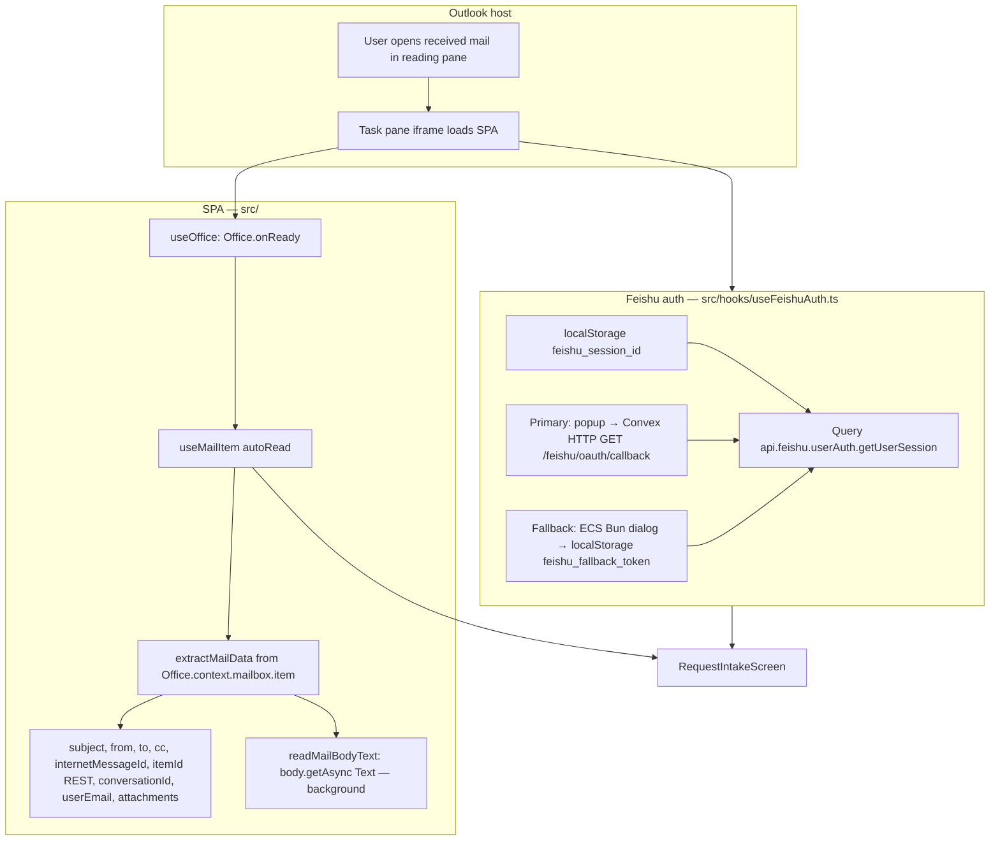
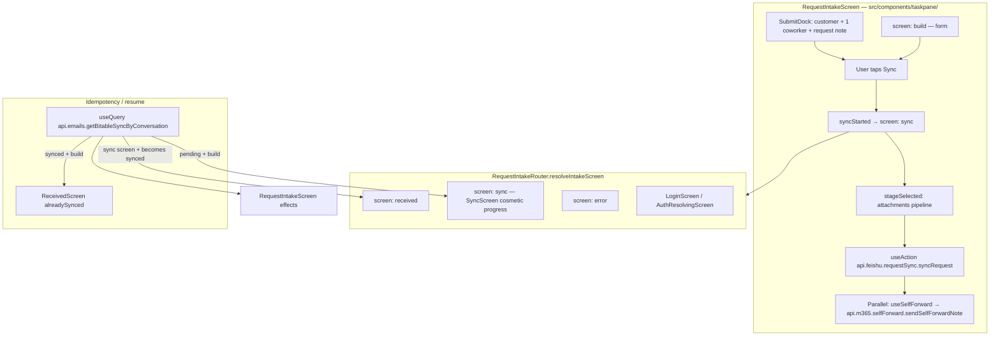
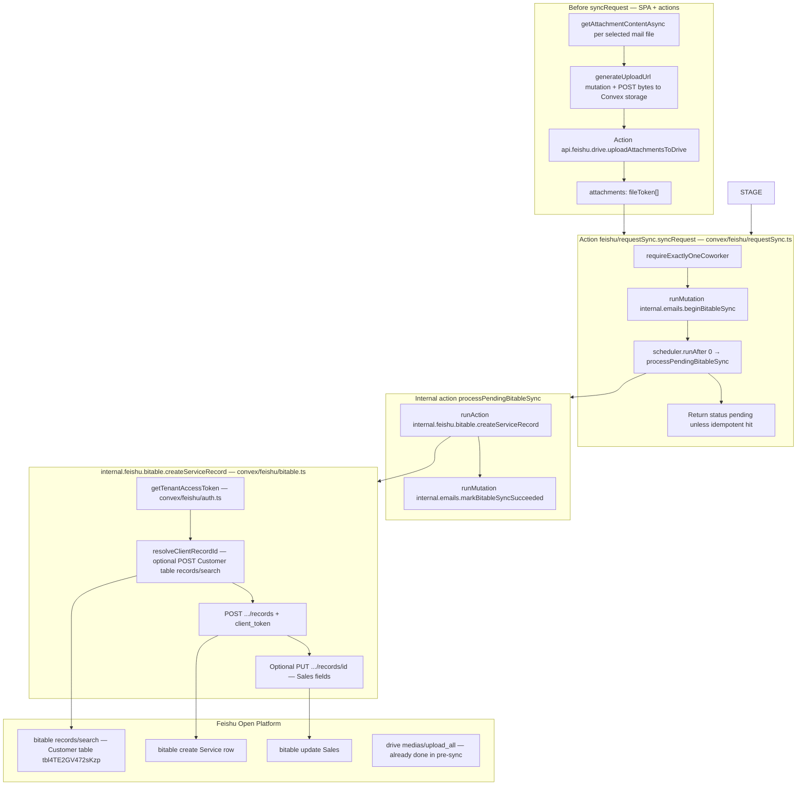
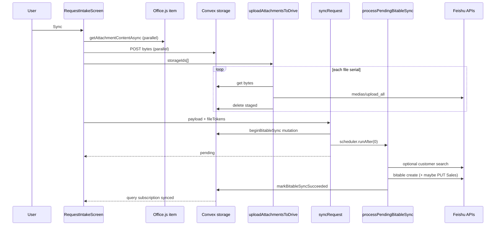

# Email→Feishu flow exploration

## User

You are a READ-ONLY exploration agent for repo: c:\Users\fenchem\outlook-sales

User goal context: `feishu/requestSync:syncRequest` Convex action takes ~7.7s. User wants future optimization (background sync, let Convex finish upload while UI shows syncing) but THIS task is documentation/exploration only — no code changes.

## Deliverables (structured report for parent to relay to user)

### 1. Mermaid flowchart: Email → Feishu Base (Outlook SPA add-in)
Trace the full path from user opening mail in Outlook task pane through Convex to Feishu Bitable row creation/sync. Include:
- Office.js mail item read (subject, body, recipients, itemId, etc.)
- Auth/session
- When sync is triggered (button, auto, router screens)
- Convex functions called (queries, mutations, actions) with file paths
- Feishu APIs (bitable, drive, etc.)

Use `very thorough` exploration across:
- src/office/* (useMailItem, useOffice)
- src/components/taskpane/* (RequestIntakeScreen, RequestIntakeRouter, etc.)
- convex/feishu/* (requestSync, drive, serviceRow, etc.)
- convex/emails.ts
- CONTEXT.md, docs/adr if relevant

### 2. Deep dive: Attachments via Office.js → file upload → Feishu `upload_all`
Document step-by-step with code citations (startLine:endLine:filepath):
- How add-in discovers attachments (Office.js APIs — name the exact API methods from code AND verify against Microsoft Office Add-ins docs)
- How attachment bytes are read (getAttachmentContentAsync? REST? blob?)
- Upload to Convex storage or direct to Feishu?
- Where Feishu `upload_all` / multipart upload is invoked (convex/feishu/drive.ts etc.)
- Sequence diagram or numbered steps

### 3. Performance / optimization adversarial review (readonly)
Based on code + Convex dashboard facts user provided:
- Break down what likely consumes the 7.7s in `syncRequest` (enumerate sequential awaits, network round-trips, file sizes) — label each as CODE-CONFIRMED vs INFERENCE
- Propose optimization directions: background action, scheduler, parallel uploads, skip redundant calls — with tradeoffs
- Parallelism opportunities already in code vs missing

### 4. Official docs only for external API claims
For Office.js, Convex actions/scheduling, and Feishu OpenAPI (upload_all, bitable):
- Use WebSearch/WebFetch to pull official doc snippets or URLs
- Every external claim must cite official Microsoft / Convex / Feishu (Lark) documentation URL
- If code does something not clearly documented, say "observed in code, doc not verified"
- NO guessing — mark unknowns explicitly

## Constraints
- READ ONLY: do not edit files
- Read convex/_generated/ai/guidelines.md if touching convex interpretation
- Project uses bun/bunx; convex-test not used
- Run scoped tests only if needed for understanding (optional)

Return a complete markdown report the parent can paste to the user, with:
1) Mermaid flowchart(s)
2) Attachment pipeline section with code citations
3) syncRequest timing breakdown table
4) Optimization plan (adversarial pros/cons)
5) Bibliography of official doc URLs used

## Assistant

Tracing the Email → Feishu sync path and attachment pipeline from the codebase and official docs.

### Tool Unspecified

```
{"currentStep":"Mapping email-to-Feishu flow"}
```

### Tool Read File V2

```
{"path":"c:\\Users\\fenchem\\outlook-sales\\CONTEXT.md","limit":150}
```

### Tool Ripgrep Raw Search

```
{"pattern":"syncRequest|requestSync","path":"c:\\Users\\fenchem\\outlook-sales","caseInsensitive":false,"multiline":false,"toolCallId":"tool_209ac7e2-8cb7-47dd-addb-10a0de20606","offset":0}
```

### Tool Glob File Search

```
{"targetDirectory":"c:\\Users\\fenchem\\outlook-sales","globPattern":"**/convex/feishu/**/*.ts"}
```

### Tool Glob File Search

```
{"targetDirectory":"c:\\Users\\fenchem\\outlook-sales","globPattern":"**/src/office/**/*.ts"}
```

### Tool Read File V2

```
{"path":"c:\\Users\\fenchem\\outlook-sales\\convex\\feishu\\requestSync.ts"}
```

### Tool Read File V2

```
{"path":"c:\\Users\\fenchem\\outlook-sales\\convex\\feishu\\drive.ts"}
```

### Tool Read File V2

```
{"path":"c:\\Users\\fenchem\\outlook-sales\\src\\hooks\\useRequestSync.ts"}
```

### Tool Read File V2

```
{"path":"c:\\Users\\fenchem\\outlook-sales\\src\\office\\useMailItem.ts"}
```

### Tool Read File V2

```
{"path":"c:\\Users\\fenchem\\outlook-sales\\src\\office\\attachments.ts"}
```

### Tool Read File V2

```
{"path":"c:\\Users\\fenchem\\outlook-sales\\src\\office\\attachmentDownload.ts"}
```

### Tool Read File V2

```
{"path":"c:\\Users\\fenchem\\outlook-sales\\src\\office\\mailItem.ts"}
```

### Tool Read File V2

```
{"path":"c:\\Users\\fenchem\\outlook-sales\\src\\office\\attachmentUpload.ts"}
```

### Tool Read File V2

```
{"path":"c:\\Users\\fenchem\\outlook-sales\\src\\components\\taskpane\\useAttachmentSync.ts"}
```

### Tool Read File V2

```
{"path":"c:\\Users\\fenchem\\outlook-sales\\convex\\feishu\\bitable.ts","limit":200}
```

### Tool Read File V2

```
{"path":"c:\\Users\\fenchem\\outlook-sales\\convex\\emails.ts","limit":250}
```

### Tool Ripgrep Raw Search

```
{"pattern":"sync\\(|uploadAttachmentsToDrive|buildSyncPayload|SyncScreen","path":"c:\\Users\\fenchem\\outlook-sales\\src\\components\\taskpane","caseInsensitive":false,"multiline":false,"toolCallId":"tool_49d02522-ee11-46a4-b1a1-5a2012d8805","offset":0}
```

### Tool Read File V2

```
{"path":"c:\\Users\\fenchem\\outlook-sales\\src\\components\\taskpane\\RequestIntakeScreen.tsx"}
```

### Tool Read File V2

```
{"path":"c:\\Users\\fenchem\\outlook-sales\\src\\components\\taskpane\\RequestIntakeRouter.tsx"}
```

### Tool Read File V2

```
{"path":"c:\\Users\\fenchem\\outlook-sales\\src\\components\\taskpane\\buildSyncPayload.ts"}
```

### Tool Read File V2

```
{"path":"c:\\Users\\fenchem\\outlook-sales\\src\\components\\taskpane\\gatherAttachmentSources.ts"}
```

### Tool Read File V2

```
{"path":"c:\\Users\\fenchem\\outlook-sales\\src\\hooks\\useAttachmentStaging.ts"}
```

### Tool Ripgrep Raw Search

```
{"pattern":"selfForward|graph|forward","path":"c:\\Users\\fenchem\\outlook-sales","glob":"*.{ts,tsx}","caseInsensitive":false,"multiline":false,"toolCallId":"tool_8583a931-798b-46f1-b791-d3ab4620ba7","offset":0}
```

### Tool Read File V2

```
{"path":"c:\\Users\\fenchem\\outlook-sales\\src\\components\\taskpane\\intakeReducer.ts","limit":130}
```

### Tool Read File V2

```
{"path":"c:\\Users\\fenchem\\outlook-sales\\src\\components\\taskpane\\useIntakeAttachments.ts"}
```

### Tool Read File V2

```
{"path":"c:\\Users\\fenchem\\outlook-sales\\src\\office\\mailBody.ts"}
```

### Tool Read File V2

```
{"path":"c:\\Users\\fenchem\\outlook-sales\\src\\components\\TaskPane.tsx","limit":120}
```

### Tool Read File V2

```
{"path":"c:\\Users\\fenchem\\outlook-sales\\docs\\adr\\0018-request-sync-outbox-and-reconcile.md","limit":80}
```

### Tool Read File V2

```
{"path":"c:\\Users\\fenchem\\outlook-sales\\convex\\feishu\\call.ts","limit":80}
```

### Tool Read File V2

```
{"path":"c:\\Users\\fenchem\\outlook-sales\\src\\components\\taskpane\\uploadIntakeFile.ts","limit":80}
```

### Tool Ripgrep Raw Search

```
{"pattern":"generateUploadUrl","path":"c:\\Users\\fenchem\\outlook-sales\\convex","caseInsensitive":false,"multiline":false,"toolCallId":"tool_da21cf83-6e78-41dc-9670-db4dd159d2a","offset":0}
```

### Tool Read File V2

```
{"path":"c:\\Users\\fenchem\\outlook-sales\\src\\hooks\\useFeishuAuth.ts","limit":80}
```

### Tool Read File V2

```
{"path":"c:\\Users\\fenchem\\outlook-sales\\docs\\adr\\0022-attachments-and-mail-body-to-base-row.md","limit":90}
```

### Tool Web Search

```
{"searchTerm":"Office.js getAttachmentContentAsync Mailbox 1.8 Microsoft documentation","toolCallId":"tool_f1ba048a-0d1b-4b01-967e-2ffee87f013"}
```

### Tool Web Search

```
{"searchTerm":"Convex scheduler runAfter action documentation","toolCallId":"tool_cd90c60b-fef1-41a3-a4c2-7846ac87a8b"}
```

### Tool Ripgrep Raw Search

```
{"pattern":"Mailbox|Requirements","path":"c:\\Users\\fenchem\\outlook-sales\\public\\manifest.xml","caseInsensitive":false,"multiline":false,"toolCallId":"tool_e26e82e9-85d2-4d7b-afe5-c32d5bae27c","offset":0}
```

### Tool Read File V2

```
{"path":"c:\\Users\\fenchem\\outlook-sales\\convex\\crons.ts"}
```

### Tool Read File V2

```
{"path":"c:\\Users\\fenchem\\outlook-sales\\convex\\m365\\selfForward.ts","limit":50}
```

### Tool Read File V2

```
{"path":"c:\\Users\\fenchem\\outlook-sales\\convex\\feishu\\serviceRow.ts","limit":100}
```

### Tool Ripgrep Raw Search

```
{"pattern":"convertToRestId|item\\.attachments","path":"c:\\Users\\fenchem\\outlook-sales","caseInsensitive":false,"multiline":false,"toolCallId":"tool_33fcdbe9-615e-4d43-a866-f140856d033","offset":0}
```

### Tool Read File V2

```
{"path":"c:\\Users\\fenchem\\outlook-sales\\convex\\feishu\\requestSync.test.ts","limit":100}
```

### Tool Read File V2

```
{"path":"c:\\Users\\fenchem\\outlook-sales\\convex\\feishu\\auth.ts","limit":60}
```

### Tool Read File V2

```
{"path":"c:\\Users\\fenchem\\outlook-sales\\src\\components\\taskpane\\SyncScreen.tsx","limit":50}
```

### Tool Web Fetch

```
{"url":"https://open.feishu.cn/document/server-docs/docs/drive-v1/media/upload_all","toolCallId":"tool_120ae7df-a550-41f0-821a-fba013bba88"}
```

### Tool Read File V2

```
{"path":"c:\\Users\\fenchem\\outlook-sales\\convex\\feishu\\bitable.ts","offset":160}
```

### Tool Read File V2

```
{"path":"c:\\Users\\fenchem\\outlook-sales\\src\\components\\taskpane\\submitSyncGate.ts","limit":40}
```

### Tool Ripgrep Raw Search

```
{"pattern":"screen.*sync|syncStarted","path":"c:\\Users\\fenchem\\outlook-sales\\src\\components\\taskpane","caseInsensitive":false,"multiline":false,"toolCallId":"tool_bad18a6d-d46d-404d-809b-16adfb3360e","offset":0}
```

### Tool Read File V2

```
{"path":"c:\\Users\\fenchem\\outlook-sales\\src\\components\\taskpane\\RequestIntakeScreen.sync.test.tsx","offset":200,"limit":80}
```

### Tool Read File V2

```
{"path":"c:\\Users\\fenchem\\outlook-sales\\src\\office\\useOffice.ts","limit":50}
```

### Tool Unspecified

```
{"currentStep":"Compiling exploration report","finalSummary":"The repo splits Base Sync into a fast `syncRequest` outbox enqueue plus a scheduled `processPendingBitableSync` that does Feishu work; attachments stage through Convex storage then serial Feishu `upload_all` before sync. A 7.7s dashboard on `syncRequest` likely measures end-to-end or the scheduled child, not the enqueue handler alone.","completedSubtitle":"Mapped email-to-Feishu sync path"}
```

## Assistant

# Email → Feishu Base: exploration report (read-only)

Repository: `c:\Users\fenchem\outlook-sales`

---

## 1. Mermaid flowchart: Outlook task pane → Convex → Feishu Bitable

### 1.1 Boot, auth, and mail read



**Code anchors:** `src/components/TaskPane.tsx`, `src/office/useOffice.ts`, `src/office/useMailItem.ts`, `src/office/mailItem.ts`, `src/office/mailBody.ts`, `src/hooks/useFeishuAuth.ts`, `convex/http.ts` (OAuth route — not re-read here; cited in CONTEXT.md).

### 1.2 Intake UI, triggers, and sync orchestration



**When sync runs:** Manual only — `SubmitDock` → `handleSubmit` → `runSync` (`RequestIntakeScreen.tsx`). No auto-sync on mail open. Auto behaviors: `useMailItem(true)` reads metadata; customer **Mirror Kick** on picker open (`useCustomerSearch`); existing-sync query when logged in.

### 1.3 Convex + Feishu (Base Sync)



**Convex surface (Base Sync path):**

| Step | Type | Symbol | File |
|------|------|--------|------|
| Upload URL | `mutation` | `storage.generateUploadUrl` | `convex/storage.ts` |
| Drive tokens | `action` | `feishu.drive.uploadAttachmentsToDrive` | `convex/feishu/drive.ts` |
| Enqueue sync | `action` | `feishu.requestSync.syncRequest` | `convex/feishu/requestSync.ts` |
| Outbox begin | `internalMutation` | `emails.beginBitableSync` | `convex/emails.ts` |
| Feishu create | `internalAction` | `feishu.bitable.createServiceRecord` | `convex/feishu/bitable.ts` |
| Mark success | `internalMutation` | `emails.markBitableSyncSucceeded` | `convex/emails.ts` |
| Background work | `internalAction` | `feishu.requestSync.processPendingBitableSync` | `convex/feishu/requestSync.ts` |
| Retry cron | `internalAction` | `feishu.requestSync.reconcilePendingBitableSync` | `convex/feishu/requestSync.ts` (every 15 min — `convex/crons.ts`) |
| Conversation lookup | `query` | `emails.getBitableSyncByConversation` | `convex/emails.ts` |
| Correction | `action` | `feishu.requestSync.correctRequest` | `convex/feishu/requestSync.ts` |

**Parallel path (not Feishu):** `api.m365.selfForward.sendSelfForwardNote` → Graph `message/forward` (`convex/m365/selfForward.ts`, `selfForwardChain.ts`). Soft-fail; does not roll back Bitable row (ADR-0017).

**Domain docs:** `CONTEXT.md` (Base Sync, Mail Item, Attachment), ADR-0010 (pivot), ADR-0012 (create-only + correction), ADR-0018 (outbox), ADR-0022 (attachments/body).

---

## 2. Attachment pipeline (Office.js → Convex storage → Feishu `upload_all`)

### 2.1 Discovery (no bytes yet)

| Step | API (from code) | Requirement set (manifest / code) | File |
|------|-----------------|-----------------------------------|------|
| List metadata | `item.attachments` → `AttachmentDetails` | Code gates on `requirements.isSetSupported("Mailbox", "1.8")`; manifest `MinVersion="1.8"` | `src/office/mailItem.ts`, `public/manifest.xml` |
| Filter picker | `attachmentType === "file" && !isInline` | ADR-0022 | `src/office/attachments.ts` `selectableMailAttachments` |

Microsoft also documents `item.attachments` at Mailbox **1.1** and `getAttachmentsAsync` at **1.8** on the [get attachments](https://learn.microsoft.com/en-us/office/dev/add-ins/outlook/get-attachments-of-an-outlook-item) page. This repo reads `item.attachments` directly with a 1.8 gate — **observed in code**; not verified that 1.8 is strictly required for the property read alone.

### 2.2 Download bytes (mail attachments)

| Step | API | File |
|------|-----|------|
| Per selected file | `item.getAttachmentContentAsync(attachmentId, callback)` | `src/office/attachmentDownload.ts` |
| Success check | `result.status === office.AsyncResultStatus.Succeeded` | same |
| Format | `result.value.format === office.MailboxEnums.AttachmentContentFormat.Base64` | same |
| Decode | `atob` → `Blob` with MIME from extension | `src/office/attachmentUpload.ts` `base64ToBlob`, `mimeFromName` |

**Official:** [Office.AttachmentContent](https://learn.microsoft.com/en-us/javascript/api/outlook/office.attachmentcontent), [get attachments guide](https://learn.microsoft.com/en-us/office/dev/add-ins/outlook/get-attachments-of-an-outlook-item), [Mailbox 1.8](https://learn.microsoft.com/en-us/javascript/api/requirement-sets/outlook/outlook-requirement-set-1.8).

**Not used:** Microsoft Graph for attachment bytes (explicitly rejected in ADR-0022 / ADR-0015). No REST/EWS download in this path.

**Parallelism:** `gatherMailSources` uses `Promise.all` over selected mail attachments (`src/components/taskpane/gatherAttachmentSources.ts`).

### 2.3 User uploads (DOM files)

| Step | Mechanism | File |
|------|-----------|------|
| Pick files | DOM `File` in `AttachmentSection` | UI |
| Eager upload | `uploadIntakeFileToStorage` → `generateUploadUrl` + `postBytesToConvexWithProgress` (XHR progress) | `src/components/taskpane/uploadIntakeFile.ts` |
| At sync | Reuse `storageId` if `status === "complete"` | `gatherAttachmentSources.ts` |

### 2.4 Convex File Storage staging

| Step | API | File |
|------|-----|------|
| Mint URL | `useMutation(api.storage.generateUploadUrl)` → `ctx.storage.generateUploadUrl()` | `convex/storage.ts`, `src/hooks/useAttachmentStaging.ts` |
| POST bytes | `fetch(url, { method: "POST", body: blob })` or XHR | `src/office/attachmentUpload.ts` `postBytesToConvex` |
| Orchestration | `stageAndUploadAttachments` — **parallel** `Promise.all` per source for Convex POST | `src/office/attachmentUpload.ts` |

**Official:** [Convex upload files](https://docs.convex.dev/file-storage/upload-files), [storage limits / action arg 5 MiB on Node](https://docs.convex.dev/production/state/limits) — cited in ADR-0022.

**Not direct to Feishu from browser:** ADR-0022 — tenant token + no CORS path for `upload_all`.

### 2.5 Feishu Drive `upload_all`

| Step | API | File |
|------|-----|------|
| Action | `api.feishu.drive.uploadAttachmentsToDrive` | `convex/feishu/drive.ts` |
| Read staged blob | `getStorageBytes(ctx, storageId)` | `convex/storage` helper |
| Upload | `POST /drive/v1/medias/upload_all` multipart: `file_name`, `parent_type=bitable_file`, `parent_node=<FEISHU_BITABLE_APP_TOKEN>`, `size`, `file` | `uploadMediaToDrive` |
| Auth | `resolveFeishuToken(ctx, "tenant")` | `convex/feishu/call.ts` |
| After success | `ctx.storage.delete(storageId)` | `drive.ts` handler loop |
| Rate limit | **Serial** uploads + `withDriveRateLimitRetry` on code `99991400` | `convex/feishu/drive.ts` |

**Official:** [Feishu upload_all](https://open.feishu.cn/document/server-docs/docs/drive-v1/media/upload_all) — ≤20 MB, **5 QPS / 10,000/day**; `bitable:app` permission sufficient.

**Prefetch:** While uploading file *N*, file *N+1* bytes are read from Convex storage in parallel (`prepareDriveSource` ahead of serial loop) — **CODE-CONFIRMED** in `drive.ts` lines 139–161.

### 2.6 Into `syncRequest`

SPA calls `sync({ ...buildSyncPayload(...), attachments: staged.attachments })` (`RequestIntakeScreen.tsx`). Tokens are minted **before** `syncRequest` so Feishu `client_token` retries do not re-upload bytes (ADR-0022).

### 2.7 Numbered sequence (submit with 2 mail files + 1 upload)

1. User taps Sync → `syncStarted` → `SyncScreen` (cosmetic progress only).
2. `stageSelected`: await in-flight eager uploads; `gatherAttachmentSources`.
3. Parallel: `getAttachmentContentAsync` × N (mail).
4. Parallel: Convex storage POST × sources needing blobs.
5. **One** `uploadAttachmentsToDrive` action: serial Feishu `upload_all` × total files (with one-step storage prefetch).
6. `syncRequest`: `beginBitableSync` mutation → schedule `processPendingBitableSync` → return `{ status: "pending" }`.
7. Scheduled `processPendingBitableSync`: `createServiceRecord` (Feishu) → `markBitableSyncSucceeded`.
8. UI: `getBitableSyncByConversation` subscription flips to `synced` → `syncSucceeded` → `ReceivedScreen` (test: `RequestIntakeScreen.sync.test.tsx` “queued sync”).
9. In parallel (UI): `sendSelfForwardNote` Graph forward (optional chip on failure).



---

## 3. `syncRequest` timing breakdown (~7.7s)

**Critical CODE-CONFIRMED fact:** `syncRequest` itself does **not** call Feishu create inline. It runs `beginBitableSync`, schedules `processPendingBitableSync` with `runAfter(0)`, and returns `pending` without `recordId` (`convex/feishu/requestSync.ts`; unit test asserts `runAction` not called on enqueue).

If the Convex dashboard labels **7.7s** on `feishu/requestSync:syncRequest`, plausible interpretations:

| Interpretation | Label | Evidence |
|----------------|-------|----------|
| A | Dashboard measures **child** `processPendingBitableSync` or end-to-end trace | **INFERENCE** — not verified in this exploration |
| B | Measurement includes **pre-sync** `uploadAttachmentsToDrive` + `syncRequest` in one user gesture | **INFERENCE** — SPA awaits `stageSelected()` before `sync()` |
| C | Older deployment inlined create in `syncRequest` | **INFERENCE** — ADR-0018 prose still describes inline create; code has diverged toward scheduler |

### 3.1 Timing table (wall-clock contributors)

| Phase | Location | Sequential awaits / RTTs | Dominant cost driver | Label |
|-------|----------|---------------------------|----------------------|-------|
| Mail body (background) | SPA `useMailItem` | 1× `body.getAsync(Text)` | Large HTML→text on slow clients | CODE-CONFIRMED path; **INFERENCE** on ms |
| Attachment download | SPA `gatherMailSources` | N parallel `getAttachmentContentAsync` | N × size up to 25 MB pre-Base64 (Office limit per ADR-0022) | CODE-CONFIRMED parallel; limit from ADR/doc |
| Convex storage POST | SPA `stageAndUploadAttachments` | N parallel POSTs to upload URLs | Upload bandwidth × file size | CODE-CONFIRMED |
| Feishu Drive | `uploadAttachmentsToDrive` | **Serial** N × (`getStorageBytes` + `upload_all` + delete) | N × (RTT + bytes/throughput); 5 QPS cap | CODE-CONFIRMED serial |
| Tenant token | `getTenantAccessToken` | 0–1 Feishu auth if cache miss | Usually cached in `feishuTokens` | CODE-CONFIRMED |
| Outbox write | `beginBitableSync` | 1 mutation | DB write | CODE-CONFIRMED |
| `syncRequest` handler | `requestSync.ts` | mutation + `scheduler.runAfter` | Should be sub-second | CODE-CONFIRMED structure |
| Bitable create chain | `processPendingBitableSync` | `createServiceRecord` action | See below | CODE-CONFIRMED |
| Customer domain match | `matchClientRecordId` | 0–1 POST `records/search` on Customer table | Skipped if `clientRecordId` from picker | CODE-CONFIRMED conditional |
| Service row create | `createServiceRecord` | 1 POST create (+ optional 1 PUT Sales) | Payload size (body text, field count) | CODE-CONFIRMED |
| Mark synced | `markBitableSyncSucceeded` | 1 mutation | Small | CODE-CONFIRMED |
| UI completion | SPA | Waits on `getBitableSyncByConversation` until `synced` | Scheduled action latency + WS query delay | CODE-CONFIRMED test |
| Self-Forward | `m365.selfForward` | Graph token + forward (parallel) | Graph RTT | CODE-CONFIRMED parallel, not in `syncRequest` |

**Rough model for N attachments, no customer search (INFERENCE):**

`T_total ≈ T_download_parallel + T_convex_upload_parallel + Σ_i T_feishu_upload_i + T_create + T_patch + T_mutations + T_schedule`

With 3× ~2 MB files, serial Feishu uploads alone can be **multiple seconds** even if `syncRequest` enqueue is fast.

**Unknown without dashboard spans:** exact 7.7s split; per-call Feishu latency; body length; cache hits.

---

## 4. Optimization plan (adversarial)

### 4.1 Already aligned with “background sync”

| Idea | Status in code | Tradeoff |
|------|----------------|----------|
| Fast enqueue + async Feishu | `syncRequest` → `runAfter(0, processPendingBitableSync)` | UI must subscribe to outbox (`getBitableSyncByConversation`) — **done**; user still waits on submit for **attachments** before enqueue |
| Idempotent Feishu create | `client_token` on create | Retries safe; tokens must be pre-minted |
| Outbox + cron reconcile | 15 min `reconcilePendingBitableSync` | Reconcile **drops attachments** (no tokens on Email Record) — ADR-0022 known limitation |

### 4.2 Background / UX (user goal)

| Direction | Pros | Cons |
|-----------|------|------|
| Return `pending` immediately; move **attachment staging** after enqueue or into `processPendingBitableSync` | Shorter time-to-`sync` action; Sync screen can mean “queued” honestly | Must persist `storageId`s or attachment ids on Email Record; reconcile must replay uploads; larger schema/outbox |
| Mint Drive tokens inside scheduled action from stored blobs | Single server-side pipeline | Longer action runtime; Convex action timeouts; still serial Feishu QPS |
| Show “syncing” on `pending` without waiting for `recordId` from action | Matches scheduler model | Already partially true; success still needs query update |

### 4.3 Parallelism

| Opportunity | Present? | Risk |
|-------------|----------|------|
| Parallel mail `getAttachmentContentAsync` | Yes | Host/memory pressure on many large files |
| Parallel Convex storage POST | Yes | — |
| Parallel Feishu `upload_all` | **No** (serial by design) | **99991400** rate limit — observed in ADR-0022 |
| Limited parallel Feishu (e.g. 2–3) with backoff | Not implemented | May still trip 5 QPS; needs measurement |
| Parallel reconcile rows | Yes (`Promise.all` up to 20) | Feishu burst load |

### 4.4 Skip redundant work

| Call | When skipped | Gap |
|------|--------------|-----|
| Customer bitable search | `clientRecordId` set from picker | Auto-match path still searches if no override |
| `uploadAttachmentsToDrive` | `sources.length === 0` | — |
| Second `syncRequest` | `beginBitableSync` returns existing `bitableRecordId` | — |
| Re-upload on retry | Same `fileToken`s + `client_token` | Reconcile path lacks attachments |

### 4.5 Split actions for observability

Measure separately in dashboard: `uploadAttachmentsToDrive`, `syncRequest`, `processPendingBitableSync`, `createServiceRecord`. **INFERENCE:** 7.7s may be dominated by Drive serial loop, not `syncRequest` enqueue.

### 4.6 Anti-patterns to avoid

- Parallel `upload_all` without backoff — **documented failure** in ADR-0022.
- Browser-direct Feishu upload — rejected (auth/CORS/5 MiB action args).
- Blocking UI on Self-Forward — already non-blocking.

---

## 5. Bibliography (official URLs only)

### Microsoft Office / Outlook

- Get attachments (API table): https://learn.microsoft.com/en-us/office/dev/add-ins/outlook/get-attachments-of-an-outlook-item
- `Office.AttachmentContent`: https://learn.microsoft.com/en-us/javascript/api/outlook/office.attachmentcontent
- `Office.AttachmentDetails`: https://learn.microsoft.com/en-us/javascript/api/outlook/office.attachmentdetails
- `Office.Body.getAsync`: https://learn.microsoft.com/en-us/javascript/api/outlook/office.body
- Mailbox requirement set 1.8: https://learn.microsoft.com/en-us/javascript/api/requirement-sets/outlook/outlook-requirement-set-1.8
- `convertToRestId`: https://learn.microsoft.com/en-us/javascript/api/outlook/office.mailbox#outlook-office-mailbox-converttorestid-member
- Graph `message: forward`: https://learn.microsoft.com/en-us/graph/api/message-forward

### Convex

- Scheduled functions (`runAfter`, delay 0): https://docs.convex.dev/scheduling/scheduled-functions
- Scheduler API: https://docs.convex.dev/api/interfaces/server.Scheduler
- Actions (scheduler field, parallelism note): https://docs.convex.dev/functions/actions
- File storage upload: https://docs.convex.dev/file-storage/upload-files
- Production limits: https://docs.convex.dev/production/state/limits

### Feishu / Lark Open Platform

- Drive `medias/upload_all`: https://open.feishu.cn/document/server-docs/docs/drive-v1/media/upload_all
- Generic error code 99991400 (frequency): https://open.feishu.cn/document/server-docs/api-call-guide/generic-error-code
- Frequency control: https://open.feishu.cn/document/server-docs/api-call-guide/frequency-control
- Bitable create record: https://open.feishu.cn/document/server-docs/docs/bitable-v1/app-table-record/create
- Bitable update record: https://open.feishu.cn/document/server-docs/docs/bitable-v1/app-table-record/update
- Bitable search records: https://open.feishu.cn/document/server-docs/docs/bitable-v1/app-table-record/search
- Bitable field data shapes: https://open.feishu.cn/document/docs/bitable-v1/app-table-record/bitable-record-data-structure-overview

---

## 6. Notable code vs doc gaps

- **ADR-0018** text still describes `syncRequest` calling `createServiceRecord` inline; **code** schedules `processPendingBitableSync` — treat ADR narrative as partially stale relative to `convex/feishu/requestSync.ts`.
- **`SyncScreen`** progress is cosmetic; completion is `existingSync` / `syncSucceeded` (`SyncScreen.tsx` comment).
- **Reconcile** rebuilds intake from Email Record **without** `attachments` or full `body` (`reconcilePendingBitableSync` uses `bodyPreview` only) — ADR-0022 consequence.

---

*Exploration only — no files modified.*
