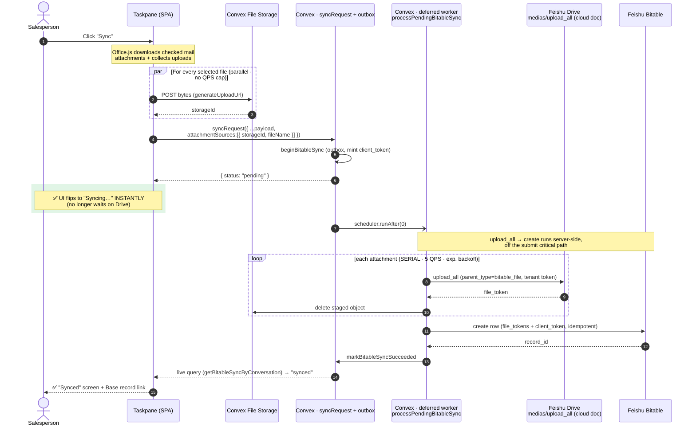
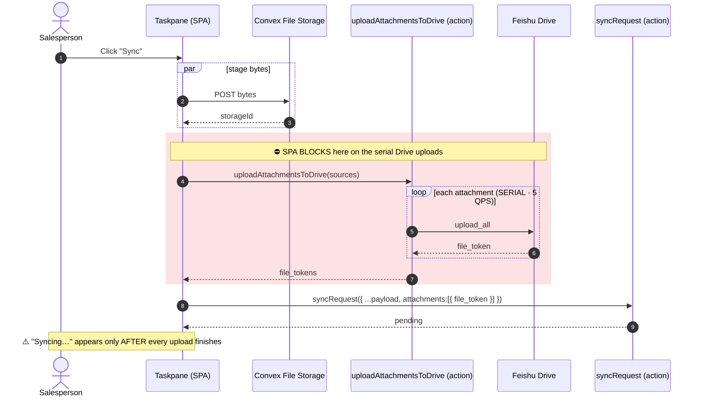
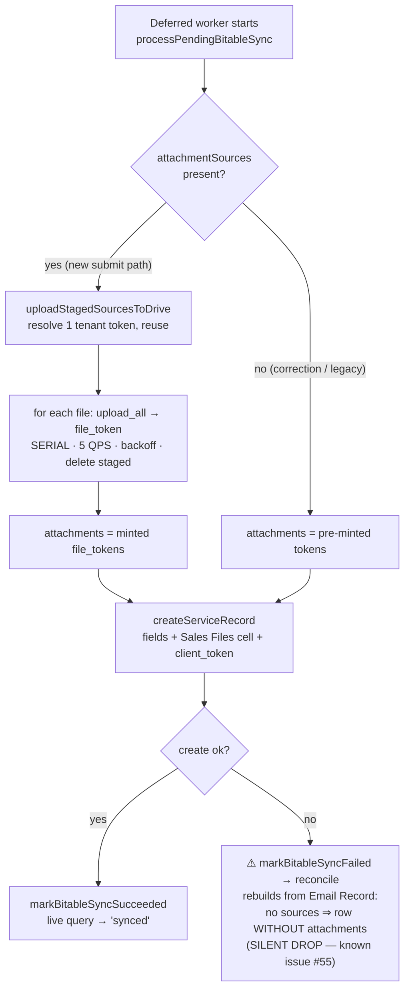
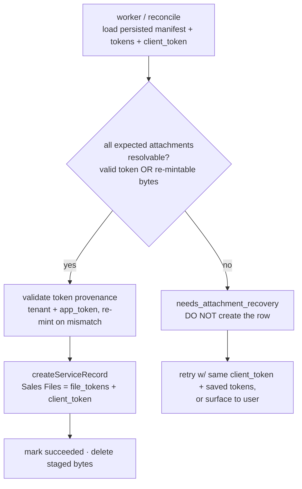

# Attachments → cloud doc (Feishu Drive) upload flow — UX latency optimization

Illustrates the [ADR-0022](../adr/0022-attachments-and-mail-body-to-base-row.md)
amendment: the Drive `medias/upload_all` (“upload all attachments to the cloud
doc”) moved **off the submit critical path** into the deferred Base-write worker,
so the taskpane flips to **“Syncing…” instantly** instead of blocking on the
serial 5 QPS Drive uploads.

## After — end-to-end in the backend (improved UX)

## Before — SPA blocked on serial Drive uploads (slow UX)

## Worker decision logic — `resolveSyncAttachments` (current — shipped)

> ⚠️ **Known issue (#55):** the highlighted `J` branch is a *silent degraded success* — a Drive-upload failure ends with a bare row and a green "Synced". The proposed fix below replaces it with a hard `needs_attachment_recovery` state.

## Corrected logic — no-bare-row invariant (PROPOSED, #55 — not yet implemented)

## Why the UX improves

- **Instant feedback:** `syncRequest` returns `pending` the moment the outbox row
  exists, so the taskpane shows “Syncing…” immediately instead of after the last
  Drive upload.
- **One fewer client round trip:** the SPA no longer calls
  `uploadAttachmentsToDrive` then `syncRequest` — it stages bytes once and makes a
  single `syncRequest` call carrying `attachmentSources`.
- **Slow work moved server-side:** the 5 QPS serial `upload_all` + the Bitable
  create now run together in the background worker (warm tenant token), not on the
  user’s click path.
- **Same guarantees:** tokens are still minted *before* the create, the worker is
  scheduled exactly once (`beginBitableSync`), so the create stays idempotent and
  there are no duplicate uploads.
