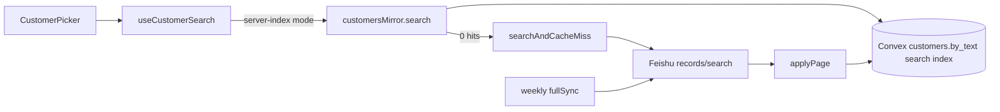
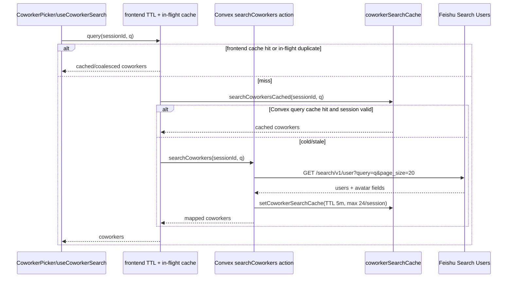

# Search latency review: Feishu customer + coworker search

_Last updated: 2026-06-01_

## Outcome

- **Customer search:** keep the Convex **server-indexed Customer Mirror** as the production path for large Customer Tables (`VITE_CUSTOMER_SEARCH_MODE=server-index`). The hot query is `convex/feishu/customersMirror.ts:search`, backed by `convex/schema.ts` search index `customers.by_text`.
- **Customer mirror refresh latency/cost:** `applyPage` now skips no-op writes when mirrored rows are unchanged. This avoids unnecessary Convex invalidation, search-index rewrites, replication work, and reactive subscriber churn during weekly full refreshes.
- **Coworker/contact search:** keep Feishu's official Search Users API (`GET /open-apis/search/v1/user`) as the source of truth, but add a session-validated Convex query cache plus frontend in-flight de-dup/TTL cache to avoid repeated Feishu round-trips and action runtime overhead for identical query bursts.
- **Experiment loop:** `scripts/search-latency-experiment.mjs` plus `bun run search:experiment` provide repeatable Convex-backed p50/p95 probes for customer mirror search and coworker cache-hit search.

## Official-doc constraints used

| Area | Constraint | Source / implementation evidence |
|---|---|---|
| Customer table reads | Use Bitable `records/search` (`POST /bitable/v1/apps/{app}/tables/{table}/records/search`) with `page_size`, `page_token`, `has_more`, and `total`. | Feishu official docs: <https://open.feishu.cn/document/server-docs/docs/bitable-v1/app-table-record/search>; implemented in `convex/feishu/customersMirror.ts:fetchMirrorPage`. |
| Feishu rate limit | Bitable record APIs are rate-limited; mirror paces page fetches at 60ms minimum interval (~16.6 req/s), below the documented 20 req/s ceiling. | Feishu official docs: <https://open.feishu.cn/document/server-docs/api-call-guide/frequency-control>; implemented as `MIN_PAGE_REQUEST_INTERVAL_MS = 60`. |
| Coworker search | Search Users is `GET /open-apis/search/v1/user` with `query` URL param and `contact:user:search` user-token scope. | Feishu official docs cited in `docs/adr/0003-feishu-user-scopes-and-search-v1.md`; implemented in `convex/feishu/coworkers.ts`. |
| Search index | Push search to Convex storage with `withSearchIndex`, not JS filtering or full-table scans. | Convex text-search docs: <https://docs.convex.dev/database/text-search>; implemented in `convex/feishu/customersMirror.ts:search` and `convex/schema.ts`. |

## Current architecture





## Changes in this iteration

1. `convex/feishu/customersMirror.ts` + `src/hooks/useCustomerSearchServerIndex.ts`
   - Adds `customerRowChanged` diffing.
   - `applyPage` returns `unchanged` and skips `ctx.db.patch` when the mirrored Customer projection is identical.
   - `customersMirrorState` records `lastUnchangedCount` for refresh observability.
   - Throttles on-search `customersMirror.kick` to one full refresh per taskpane session every 15 minutes, while cache-miss backfill still covers cold queries.
   - Keeps full mirror sync at Feishu's documented max page size (500), but caps interactive cache-miss live search at 50 rows and requests only the projected Customer fields to reduce payload and write fanout for typeahead misses.
2. `convex/schema.ts`
   - Adds `coworkerSearchCache` with `by_session_query`, `by_session_cachedAt`, and `by_cachedAt` indexes for lookup, per-session eviction, and TTL cleanup.
   - Adds optional `lastUnchangedCount` to `customersMirrorState`.
3. `convex/feishu/coworkers.ts`
   - Adds internal cache query/mutation plus public `searchCoworkersCached` query for warm Search Users results.
   - Validates the primary server-side Feishu session before returning cached results; fallback browser-held tokens bypass the shared server cache.
   - Keeps Feishu as source of truth on cold/stale cache misses.
   - Preserves avatar fallback order: `avatar_72`, `avatar_240`, `avatar_640`, `avatar_origin`, `avatar_url`.
4. `src/hooks/useCoworkerSearch.ts`
   - Adds module-level TTL cache, LRU-style pruning, token-scoped fallback cache keys, in-flight promise coalescing, and a public-query warm-cache check before the action fallback.
   - Adds timing/debug logs for cache hits, coalesced calls, network calls, and failures.
5. `scripts/search-latency-experiment.mjs`
   - Seeds synthetic customers, coworker cache rows, and one benchmark Feishu session token row into an explicitly acknowledged disposable Convex deployment.
   - Repeatedly runs `feishu/customersMirror:search` and `feishu/coworkers:searchCoworkersCached`.
   - Prints CLI wall-time p50/p95/min/max.

## Verification

Commands run successfully after implementation:

```bash
bun run test convex/feishu/coworkers.test.ts convex/feishu/customersMirror.test.ts convex/feishu/customerMirrorSync.test.ts src/hooks/useCoworkerSearch.test.ts
bun run typecheck
bun run lint
bun run test
```

Full-suite result: `28` Vitest files passed, `208` tests passed.

## Experiment command

```bash
bun run search:experiment -- --project feishu-route --deployment dev --customer-count 10000 --customer-queries 30 --destructive-ok
```

Use this only on a disposable/dev deployment. The script requires `--destructive-ok` because it imports synthetic rows with `--replace` into `customers`, `coworkerSearchCache`, and `feishuUserTokens`; add `--cleanup` to replace those tables with empty arrays afterward.

## Notes on RLM / autoresearch

- `rlm` was attempted for plan refinement, but the runtime failed before producing output: `undefined is not an object (evaluating 'normalized.startsWith')`.
- Autoresearch-style iteration is represented by a concrete benchmark harness and repeatable verification gates. A live autoresearch run should use the experiment command above on a disposable Convex deployment to compare p50/p95 after each optimization.
