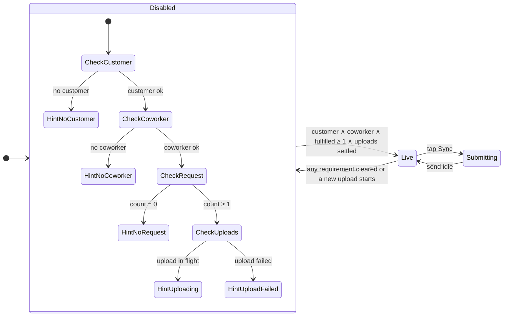

# Submit dock sync gate

The bottom **Sync** dock on the request intake screen stays disabled until the
user has completed every prerequisite. Partial progress (two of three) never
enables the button.

## Prerequisites

| # | Requirement | How the UI satisfies it |
| --- | --- | --- |
| 1 | **Customer** | A row is chosen in the customer picker (`selectedCustomer` is set), including auto-match from the client email. |
| 2 | **Coworker** | Exactly one Feishu coworker is selected on the cards. |
| 3 | **Request** | At least one of Quotation, Sample, or R&D Support has a **non-empty trimmed note**. Opening a card without typing does not count. |
| 4 | **Uploads settled** | Every selected, valid upload has finished (`status: "complete"`). While a pick is still pending/uploading the dock stays grayed; a failed pick must be **retried to completion or removed**. Unselected or rejected rows never gate. |

Logic lives in `submitSyncGate.ts` (`canSubmitSync`, `submitSyncHint`,
`uploadGateState`) and is wired from `useRequestIntakeScreen.ts` (`syncGate`)
into `SubmitDock` as `canSubmit` / `data-live`. Requirement 4 closes the race
where a tap during an in-flight upload synced the row with an empty Sales Files
cell — i.e. "without any attachments" (ADR-0027). The submit-time
`stageSelected()` still awaits any pending uploads as a belt-and-suspenders, but
the dock no longer presents itself as live mid-upload.

## Disabled hint copy

When disabled, the dock shows the first missing item in top-to-bottom screen order:

1. No customer → “Select a customer”
2. No coworker → “Choose exactly one Feishu coworker”
3. No fulfilled request → “Start a request below”
4. Upload in flight → “Waiting for attachments to finish uploading”
5. Upload failed → “Retry or remove the failed attachment”

When all are met, the primary label replaces the hint (e.g. “Sync with …”).

## State diagram

## Visual states (`SubmitDock`)

- **Live:** primary fill, `shadow-float`, hover lift, `active:scale-[0.96]`, arrow icon when `count > 0`.
- **Disabled:** muted fill, no float shadow, `cursor-not-allowed`, no press scale (`disabled` + no `data-live`).
